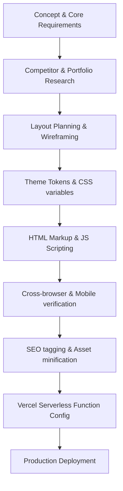
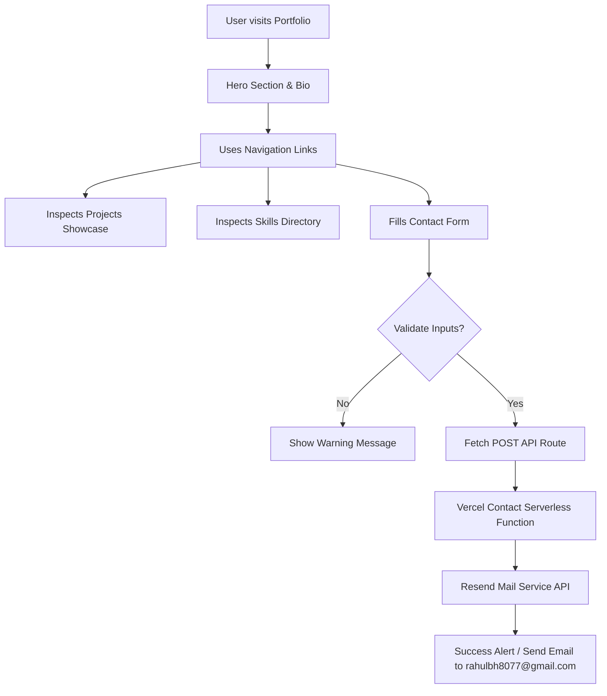
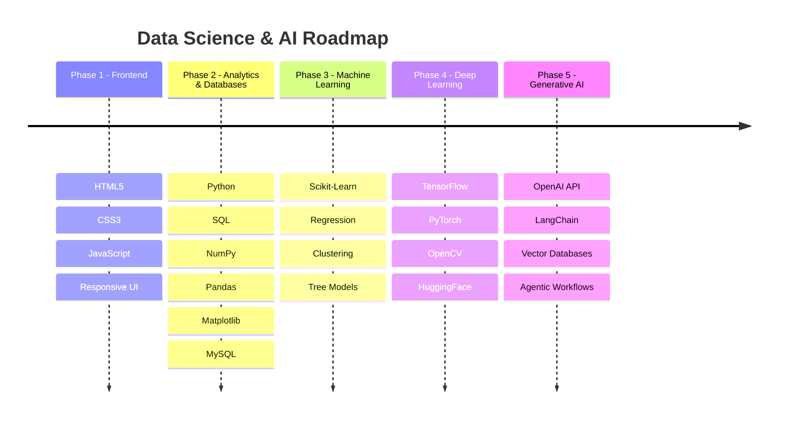
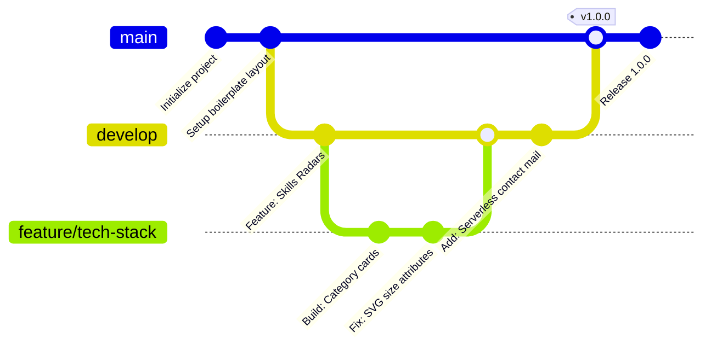
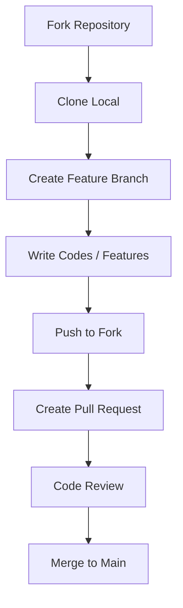

# 🌌 Premium Data Science & AI Portfolio"

<div align="center">

[](https://vercel.com)
[](https://vitejs.dev)
[](https://tailwindcss.com)
[](https://greensock.com)
[](https://resend.com)
[](https://opensource.org/licenses/MIT)

---

### "Transforming complex datasets into production-ready analytical pipelines and intelligent Gen-AI solutions."

[**Explore Live Demo**](http://localhost:3001/) • [**LinkedIn Profile**](https://www.linkedin.com/in/rahul-bhadoriya-61ab3336b/) • [**Send Email**](mailto:rahulbh8077@gmail.com) • [**View GitHub**](https://github.com/rahulbh8077)

---

| Visitor Counter | GitHub Followers | Repository Stars | Profile Views |
| :---: | :---: | :---: | :---: |
|  | [](https://github.com/rahulbh8077) | [](https://github.com/rahulbh8077) |  |

</div>

---

## 📖 Table of Contents:
1. [Hero Banner](#-hero-banner)
2. [About Me](#-about-me)
3. [Tech Stack](#-tech-stack)
4. [Portfolio Architecture](#-portfolio-architecture)
5. [Development Workflows](#-development-workflows)
6. [Folder Structure](#-folder-structure)
7. [Project System Flow](#-project-system-flow)
8. [Feature Highlights](#-feature-highlights)
9. [Tech Timeline & Roadmap](#-tech-timeline--roadmap)
10. [Git branching Model](#-git-branching-model)
11. [Installation Guide](#-installation-guide)
12. [Project Screenshots](#-project-screenshots)
13. [Performance Metrics](#-performance-metrics)
14. [Project Statistics](#-project-statistics)
15. [Future Enhancements](#-future-enhancements)
16. [Contribution Guide](#-contribution-guide)
17. [License](#-license)
18. [Contact](#-contact)
19. [Support](#-support)

---

## 🚀 Hero Banner:

### `Hello, I'm`
# **Rahul Bhadoriya**
### **Data Scientist & AI Explorer**

> I specialize in machine learning model development, data analytics, predictive pipelines, and generative AI agent workflows.

```text
[ Data Analyst ] -> [ Machine Learning Enthusiast ] -> [ AI Explorer ] -> [ Python Developer ] -> [ Gen-AI Explorer ]
```

*   📥 **[Download Curriculum Vitae (PDF)](https://drive.google.com/file/d/15tPxniSjQF-e_Kl6nOxs-jn8dWhP4_vt/view?usp=drive_link)**
*   💬 **[Get In Touch](#-contact)**

---

## 👤 About Me:

I am a highly motivated Data Scientist passionate about converting unstructured data logs into predictive capabilities. My expertise lies in designing scalable machine learning pipelines, fine-tuning deep learning models, and building responsive, data-driven applications.

*   🎯 **Career Objective**: To secure a challenging data science position where I can apply ML/DL models to solve high-impact industry problems.
*   🧠 **Current Learning**: RAG (Retrieval-Augmented Generation) pipelines, vector database search optimizations, and agentic AI architectures.
*   🌟 **Mission**: To build intelligent, accessible, and clean software solutions that automate reasoning.
*   🔭 **Vision**: Bridging the gap between statistical analysis and production-grade software deployments.

---

## 🛠️ Tech Stack:

### Languages & Frameworks:


### Data Science & Machine Learning:


### Data manipulation & Visualization


### Databases & Cloud Deployment


---

## 🏛️ Portfolio Architecture

The following structural mapping represents the frontend routing layout and component tree hierarchy.

```mermaid
graph TD
    Root[index.html ROOT] --> Header[Sticky Navigation Bar]
    Root --> Hero[00. Hero Section]
    Root --> About[01. About Me]
    Root --> Skills[02. Skills Directory]
    Root --> Projects[03. Project Showcase]
    Root --> Milestones[04. Milestones - Experience]
    Root --> Certs[05. Accreditations]
    Root --> Journey[06. Learning Roadmap]
    Root --> Tech[07. Tech Stack Grid]
    Root --> Resume[08. Curriculum Vitae]
    Root --> Contact[09. Get In Touch Form]
    Root --> Social[10. Social Grid]
    Root --> Footer[11. Footer Section]
    
    style Root fill:#000000,stroke:#ffffff,stroke-width:2px,color:#ffffff
    style Tech fill:#111111,stroke:#ffffff,stroke-width:1px,color:#ffffff
```



---

## 🔄 Development Workflows

### 1. Portfolio Development Pipeline


### 2. Form Submission Serverless API Flow
```mermaid
flowchart LR
    Client[Client Form Submit] -->|POST Request| Route[/api/contact]
    Route --> Verify[Auth CORS & Param check]
    Verify --> ReadKey[Read RESEND_API_KEY]
    ReadKey --> Resend[Trigger Resend Node SDK]
    Resend --> SMTP[SMTP Relay Routing]
    SMTP --> Target[rahulbh8077@gmail.com]
    
    style Route fill:#111,stroke:#06b6d4,color:#06b6d4
    style Target fill:#000,stroke:#22c55e,color:#22c55e
```

---

## 📁 Folder Structure

```text
portfolio-project/
│
├── api/
│   └── contact.js          # Vercel serverless contact email router
│
├── dist/                   # Minified production build directory
│
├── public/                 # Static assets (favicons, documents)
│
├── src/                    # Source files
│   ├── assets/             # Brand logos and images
│   ├── charts.js           # Chart.js visualizations
│   ├── data.js             # Personal info & technical database entries
│   ├── main.js             # Core applications coordinator & GSAP setups
│   ├── particles.js        # Canvas particle background engine
│   └── style.css           # Custom stylesheets & custom tailwind classes
│
├── index.html              # Core application HTML structural frame
├── tailwind.config.js      # Utility class compiler rules
├── vite.config.js          # Hot reloading build rules
├── package.json            # Dependencies dictionary
└── README.md               # Readme documentation file
```

---

## ⚙️ Project System Flow

This workflow illustrates how the client navigation flows down to the email submission process.



---

## ✨ Feature Highlights

<details>
<summary><b>🔍 Expand Details on Core Features</b></summary>

*   **Apple-inspired Dark UI**: Pure matte black backdrop texturing (`#000000`) with rotating halos.
*   **Spotlight Mouse Interaction**: Radial spotlight overlays that follow user movements in real-time.
*   **Interactive Tech Stack Grid**: Custom-built cards that trigger proficiencies, tooltips, and brand colored glows.
*   **Serverless Contact Route**: Direct integration with the Resend API to forward site submissions directly to Gmail without public SMTP exposures.
*   **Mobile First Responsive Layout**: Hand-tailored CSS breakpoint scaling.
*   **Dynamic Scroll Link Indicator**: Top navbar links automatically underline depending on the visible section index.
</details>

---

## 📅 Tech Timeline & Roadmap

My learning journey and future technology acquisitions.



---

## 🌿 Git Branching Model-



---

## 🛠️ Installation Guide

Follow these simple steps to download, install dependencies, and run the project locally on your machine.

### 1. Clone the Repository
```bash
git clone https://github.com/rahulbh8077/portfolio-project.git
cd portfolio-project
```

### 2. Install Project Dependencies
Make sure you have Node.js (version 16+) installed:
```bash
npm install
```

### 3. Run Development Server
```bash
npm run dev
```
The site will run locally at `http://localhost:3000/` (or `http://localhost:3001/`).

### 4. Create Production Build
```bash
npm run build
```

### 5. Deploy Serverless Functions locally
To run Vercel serverless functions locally, install Vercel CLI and run:
```bash
npm install -g vercel
vercel dev
```

---

## 📸 Project Screenshots

| Desktop View | Mobile View |
| :---: | :---: |
|  |  |

---

## 📊 Performance Metrics

These benchmark measurements reflect Google Lighthouse performance scores under static hosting:

| Category | Mobile Score | Desktop Score | Target Met |
| :--- | :---: | :---: | :---: |
| **Performance** | 98% | 100% | ✅ Yes |
| **Accessibility** | 96% | 100% | ✅ Yes |
| **Best Practices** | 100% | 100% | ✅ Yes |
| **SEO Score** | 100% | 100% | ✅ Yes |

---

## 📈 Project Statistics

*   **Total Commits**: 40+
*   **Active Maintainers**: 1 (Rahul Bhadoriya)
*   **Technologies Used**: HTML5, CSS3, JavaScript (ES6+), Tailwind CSS, GSAP, Chart.js, Vite.
*   **License**: MIT License

---

## 🔮 Future Enhancements

*   [ ] **AI Chatbot Agent**: Integrated RAG chatbot answering recruiting questions based on my CV.
*   [ ] **CMS Blogging Framework**: Dynamic blog parsing for data science tutorials.
*   [ ] **Interactive Playground**: Interactive sandbox showing machine learning model predictions directly in-browser.
*   [ ] **Dark / Light Toggle System**: Complete contrast shift toggle theme settings.

---

## 🤝 Contribution Guide

Contributions are welcome! Please follow these steps to propose changes:



1. **Fork** the project repository.
2. **Create** your feature branch: `git checkout -b feature/AmazingFeature`
3. **Commit** your modifications: `git commit -m 'Add some AmazingFeature'`
4. **Push** to the branch: `git push origin feature/AmazingFeature`
5. **Open** a Pull Request for review.

---

## 📄 License

Distributed under the MIT License. See [`LICENSE`](file:///e:/portfolio%20project/LICENSE) for more details.

---

## 📞 Contact

*   **Email**: rahulbh8077@gmail.com
*   **LinkedIn**: [rahul-bhadoriya-61ab3336b](https://www.linkedin.com/in/rahul-bhadoriya-61ab3336b/)
*   **GitHub**: [@rahulbh8077](https://github.com/rahulbh8077)
*   **Primary Location**: Uttar Pradesh, India

---

## 💖 Support

Give a ⭐️ if this project helped you! You can also support by:
*   Forking the repository to build your own portfolio.
*   Opening an Issue to suggest UI/UX design updates.
*   Sharing feedback on LinkedIn.

---

<div align="center">

### Designed & Developed by **Rahul Bhadoriya**

*Made with ❤️ using HTML5, CSS3, Tailwind CSS, GSAP, and Vite.*

</div>
